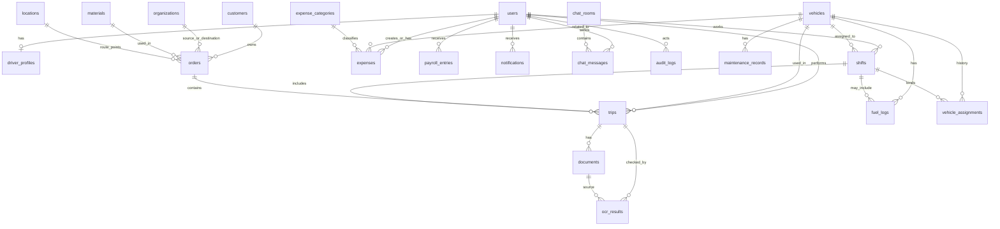

# AVL 84 - ER-модель и формальная структура данных v1

Документ переводит продуктовую логику в структурированную модель данных для PostgreSQL/Supabase.

---

## 1. Основные сущности

## 1.1. Пользователи

### users
| Поле | Тип | Обяз. | Описание |
|---|---|---:|---|
| id | uuid | Да | PK |
| role | text | Да | `admin`, `driver`, `operator` |
| full_name | text | Да | ФИО |
| phone | text | Да | Телефон |
| avatar_url | text | Нет | Аватар |
| status | text | Да | `active`, `blocked`, `invited` |
| created_at | timestamptz | Да | Дата создания |
| updated_at | timestamptz | Да | Дата обновления |

### driver_profiles
| Поле | Тип | Обяз. | Описание |
|---|---|---:|---|
| id | uuid | Да | PK |
| user_id | uuid | Да | FK -> users.id |
| license_number | text | Нет | Номер ВУ |
| employment_date | date | Нет | Дата начала работы |
| notes | text | Нет | Комментарий |

---

## 1.2. Техника

### vehicles
| Поле | Тип | Обяз. | Описание |
|---|---|---:|---|
| id | uuid | Да | PK |
| brand | text | Да | Марка |
| model | text | Нет | Модель |
| plate_number | text | Да | Госномер |
| vin | text | Нет | VIN |
| current_odometer | integer | Нет | Последний известный пробег |
| status | text | Да | `active`, `service`, `repair`, `inactive` |
| notes | text | Нет | Комментарий |
| created_at | timestamptz | Да | Дата создания |
| updated_at | timestamptz | Да | Дата обновления |

### vehicle_assignments
| Поле | Тип | Обяз. | Описание |
|---|---|---:|---|
| id | uuid | Да | PK |
| vehicle_id | uuid | Да | FK -> vehicles.id |
| driver_id | uuid | Да | FK -> users.id |
| shift_id | uuid | Нет | FK -> shifts.id |
| assigned_from | timestamptz | Да | Начало назначения |
| assigned_to | timestamptz | Нет | Конец назначения |
| created_at | timestamptz | Да | Дата создания |

---

## 1.3. Справочники

### customers
| Поле | Тип | Обяз. | Описание |
|---|---|---:|---|
| id | uuid | Да | PK |
| name | text | Да | Наименование |
| inn | text | Нет | ИНН |
| contact_person | text | Нет | Контакт |
| phone | text | Нет | Телефон |
| notes | text | Нет | Комментарий |

### organizations
| Поле | Тип | Обяз. | Описание |
|---|---|---:|---|
| id | uuid | Да | PK |
| name | text | Да | Наименование |
| type | text | Да | `source`, `destination`, `universal` |
| address | text | Нет | Адрес |
| contact_info | text | Нет | Контактная информация |
| notes | text | Нет | Комментарий |

### materials
| Поле | Тип | Обяз. | Описание |
|---|---|---:|---|
| id | uuid | Да | PK |
| name | text | Да | Материал |
| unit | text | Да | `m3`, `ton` |
| is_active | boolean | Да | Активность |

### expense_categories
| Поле | Тип | Обяз. | Описание |
|---|---|---:|---|
| id | uuid | Да | PK |
| name | text | Да | Категория |
| is_active | boolean | Да | Активность |

### locations
| Поле | Тип | Обяз. | Описание |
|---|---|---:|---|
| id | uuid | Да | PK |
| name | text | Да | Название точки |
| address | text | Да | Адрес |
| latitude | numeric(10,7) | Нет | Широта |
| longitude | numeric(10,7) | Нет | Долгота |
| comment | text | Нет | Комментарий |

---

## 1.4. Операционная деятельность

### orders
| Поле | Тип | Обяз. | Описание |
|---|---|---:|---|
| id | uuid | Да | PK |
| order_number | text | Да | Уникальный номер заявки |
| order_date | date | Да | Дата заявки |
| customer_id | uuid | Да | FK -> customers.id |
| source_org_id | uuid | Да | FK -> organizations.id |
| destination_org_id | uuid | Да | FK -> organizations.id |
| material_id | uuid | Да | FK -> materials.id |
| total_volume_planned | numeric(12,2) | Нет | Плановый объем |
| volume_unit | text | Да | `m3`, `ton` |
| pickup_location_id | uuid | Да | FK -> locations.id |
| dropoff_location_id | uuid | Да | FK -> locations.id |
| route_snapshot_json | jsonb | Нет | Снимок маршрута |
| driver_rate_per_trip | numeric(12,2) | Да | Ставка водителя за рейс |
| admin_rate_per_unit | numeric(12,2) | Нет | Управленческая ставка за тонну/м3, видна только админу |
| notes | text | Нет | Комментарий |
| status | text | Да | Статус заявки |
| created_by | uuid | Да | FK -> users.id |
| assigned_driver_id | uuid | Нет | FK -> users.id |
| assigned_vehicle_id | uuid | Нет | FK -> vehicles.id |
| created_at | timestamptz | Да | Создание |
| updated_at | timestamptz | Да | Обновление |

### shifts
| Поле | Тип | Обяз. | Описание |
|---|---|---:|---|
| id | uuid | Да | PK |
| shift_date | date | Да | Дата смены |
| driver_id | uuid | Да | FK -> users.id |
| vehicle_id | uuid | Да | FK -> vehicles.id |
| status | text | Да | Статус смены |
| start_time | timestamptz | Нет | Начало |
| end_time | timestamptz | Нет | Конец |
| closing_odometer | integer | Нет | Пробег на конец |
| fuel_filled_liters | numeric(10,2) | Нет | Заправка |
| notes | text | Нет | Комментарий |
| total_trips_cached | integer | Нет | Кэш количества рейсов |
| total_volume_cached | numeric(12,2) | Нет | Кэш объема |
| total_earnings_cached | numeric(12,2) | Нет | Кэш начисления |
| created_at | timestamptz | Да | Создание |
| updated_at | timestamptz | Да | Обновление |

### trips
| Поле | Тип | Обяз. | Описание |
|---|---|---:|---|
| id | uuid | Да | PK |
| order_id | uuid | Да | FK -> orders.id |
| shift_id | uuid | Да | FK -> shifts.id |
| driver_id | uuid | Да | FK -> users.id |
| vehicle_id | uuid | Да | FK -> vehicles.id |
| trip_number_in_shift | integer | Нет | Порядковый номер |
| trip_date | timestamptz | Да | Дата и время рейса |
| loaded_volume | numeric(12,2) | Да | Объем |
| volume_unit | text | Да | `m3`, `ton` |
| ttn_number_manual | text | Да | ТТН вручную |
| status | text | Да | Статус рейса |
| ocr_status | text | Да | Статус OCR |
| ocr_ttn_number | text | Нет | OCR ТТН |
| ocr_volume | numeric(12,2) | Нет | OCR объем |
| created_at | timestamptz | Да | Создание |
| updated_at | timestamptz | Да | Обновление |

---

## 1.5. Документы и OCR

### documents
| Поле | Тип | Обяз. | Описание |
|---|---|---:|---|
| id | uuid | Да | PK |
| entity_type | text | Да | `trip`, `shift`, `expense`, `chat_message`, `vehicle` |
| entity_id | uuid | Да | ID связанной сущности |
| document_type | text | Да | Тип документа |
| file_path | text | Да | Путь в storage |
| file_name | text | Да | Имя файла |
| mime_type | text | Да | MIME |
| uploaded_by | uuid | Да | FK -> users.id |
| uploaded_at | timestamptz | Да | Загрузка |
| metadata_json | jsonb | Нет | Метаданные |

### ocr_results
| Поле | Тип | Обяз. | Описание |
|---|---|---:|---|
| id | uuid | Да | PK |
| trip_id | uuid | Да | FK -> trips.id |
| document_id | uuid | Да | FK -> documents.id |
| provider | text | Да | Провайдер OCR |
| raw_text | text | Нет | Сырой текст |
| parsed_ttn_number | text | Нет | Распознанный ТТН |
| parsed_volume | numeric(12,2) | Нет | Распознанный объем |
| confidence | numeric(5,2) | Нет | Уверенность |
| comparison_status | text | Да | Итог сравнения |
| compared_at | timestamptz | Да | Дата сравнения |

---

## 1.6. Расходы и обслуживание

### expenses
| Поле | Тип | Обяз. | Описание |
|---|---|---:|---|
| id | uuid | Да | PK |
| expense_date | date | Да | Дата расхода |
| category_id | uuid | Да | FK -> expense_categories.id |
| vehicle_id | uuid | Нет | FK -> vehicles.id |
| driver_id | uuid | Нет | FK -> users.id |
| amount | numeric(12,2) | Да | Сумма |
| description | text | Нет | Комментарий |
| payment_status | text | Да | Статус оплаты |
| source | text | Да | `admin`, `driver` |
| created_by | uuid | Да | FK -> users.id |
| created_at | timestamptz | Да | Создание |

### fuel_logs
| Поле | Тип | Обяз. | Описание |
|---|---|---:|---|
| id | uuid | Да | PK |
| vehicle_id | uuid | Да | FK -> vehicles.id |
| driver_id | uuid | Нет | FK -> users.id |
| shift_id | uuid | Нет | FK -> shifts.id |
| liters | numeric(10,2) | Да | Литры |
| amount | numeric(12,2) | Нет | Сумма |
| odometer | integer | Нет | Пробег |
| fuel_date | timestamptz | Да | Дата заправки |
| document_id | uuid | Нет | FK -> documents.id |
| created_at | timestamptz | Да | Создание |

### maintenance_records
| Поле | Тип | Обяз. | Описание |
|---|---|---:|---|
| id | uuid | Да | PK |
| vehicle_id | uuid | Да | FK -> vehicles.id |
| service_type | text | Да | Тип работ |
| service_date | date | Да | Дата |
| odometer | integer | Да | Пробег |
| amount | numeric(12,2) | Нет | Сумма |
| description | text | Нет | Описание |
| next_service_date | date | Нет | Следующее ТО |
| next_service_odometer | integer | Нет | Следующий пробег |
| created_by | uuid | Да | FK -> users.id |

---

## 1.7. Зарплата и отчетность

### payroll_entries
| Поле | Тип | Обяз. | Описание |
|---|---|---:|---|
| id | uuid | Да | PK |
| driver_id | uuid | Да | FK -> users.id |
| shift_id | uuid | Нет | FK -> shifts.id |
| trip_id | uuid | Нет | FK -> trips.id |
| period_start | date | Да | Начало периода |
| period_end | date | Да | Конец периода |
| rate_per_trip | numeric(12,2) | Да | Ставка |
| trips_count | integer | Да | Кол-во рейсов |
| amount_accrued | numeric(12,2) | Да | Начислено |
| adjustment_amount | numeric(12,2) | Нет | Корректировка |
| final_amount | numeric(12,2) | Да | Итог |
| payment_status | text | Да | Статус выплаты |
| created_at | timestamptz | Да | Создание |

### reports
| Поле | Тип | Обяз. | Описание |
|---|---|---:|---|
| id | uuid | Да | PK |
| report_type | text | Да | Тип отчета |
| period_start | date | Да | Начало периода |
| period_end | date | Да | Конец периода |
| filters_json | jsonb | Нет | Использованные фильтры |
| file_path | text | Нет | Файл выгрузки |
| generated_by | uuid | Да | FK -> users.id |
| generated_at | timestamptz | Да | Дата генерации |

---

## 1.8. Коммуникация и аудит

### chat_rooms
| Поле | Тип | Обяз. | Описание |
|---|---|---:|---|
| id | uuid | Да | PK |
| room_type | text | Да | `general`, `order`, `system` |
| title | text | Да | Название комнаты |
| created_at | timestamptz | Да | Создание |

### chat_messages
| Поле | Тип | Обяз. | Описание |
|---|---|---:|---|
| id | uuid | Да | PK |
| room_id | uuid | Да | FK -> chat_rooms.id |
| sender_id | uuid | Да | FK -> users.id |
| reply_to_message_id | uuid | Нет | FK -> chat_messages.id |
| message_text | text | Да | Текст сообщения |
| linked_entity_type | text | Нет | `order`, `trip`, `shift`, `vehicle` |
| linked_entity_id | uuid | Нет | ID связанной сущности |
| created_at | timestamptz | Да | Создание |
| edited_at | timestamptz | Нет | Редактирование |
| deleted_at | timestamptz | Нет | Мягкое удаление |

### notifications
| Поле | Тип | Обяз. | Описание |
|---|---|---:|---|
| id | uuid | Да | PK |
| user_id | uuid | Да | FK -> users.id |
| type | text | Да | Тип уведомления |
| title | text | Да | Заголовок |
| body | text | Да | Текст |
| linked_entity_type | text | Нет | Тип сущности |
| linked_entity_id | uuid | Нет | ID сущности |
| is_read | boolean | Да | Прочитано |
| created_at | timestamptz | Да | Создание |

### audit_logs
| Поле | Тип | Обяз. | Описание |
|---|---|---:|---|
| id | uuid | Да | PK |
| user_id | uuid | Да | FK -> users.id |
| action | text | Да | Действие |
| entity_type | text | Да | Сущность |
| entity_id | uuid | Да | ID сущности |
| old_data_json | jsonb | Нет | До изменения |
| new_data_json | jsonb | Нет | После изменения |
| created_at | timestamptz | Да | Создание |

---

## 2. Кардинальности связей

- `users 1 -> 1 driver_profiles` для водителей;
- `users 1 -> many shifts`;
- `users 1 -> many trips`;
- `vehicles 1 -> many shifts`;
- `vehicles 1 -> many trips`;
- `vehicles 1 -> many fuel_logs`;
- `vehicles 1 -> many maintenance_records`;
- `orders 1 -> many trips`;
- `shifts 1 -> many trips`;
- `trips 1 -> many documents`;
- `trips 1 -> many ocr_results`;
- `chat_rooms 1 -> many chat_messages`;
- `users 1 -> many notifications`.

---

## 3. Mermaid ER-диаграмма

---

## 4. Индексы, которые стоит заложить сразу

### Уникальные
- `orders(order_number)`
- `vehicles(plate_number)`

### Часто используемые индексы
- `orders(order_date)`
- `orders(status)`
- `orders(assigned_driver_id)`
- `orders(assigned_vehicle_id)`
- `trips(order_id)`
- `trips(shift_id)`
- `trips(driver_id)`
- `trips(vehicle_id)`
- `trips(trip_date)`
- `trips(status)`
- `trips(ocr_status)`
- `shifts(driver_id, shift_date)`
- `documents(entity_type, entity_id)`
- `expenses(vehicle_id, expense_date)`
- `fuel_logs(vehicle_id, fuel_date)`
- `maintenance_records(vehicle_id, service_date)`
- `notifications(user_id, is_read)`

---

## 5. Поля, которые должны иметь ограничения

### CHECK-ограничения
- `loaded_volume >= 0`
- `fuel_filled_liters >= 0`
- `amount >= 0`
- `current_odometer >= 0`
- `closing_odometer >= 0`
- `liters >= 0`

### NOT NULL, где критично
- статусные поля;
- FK у рейса на заявку, смену, водителя и машину;
- файл `ttn` для рейсовых документов.

---

## 6. Рекомендации по RLS в Supabase

### Для drivers
- читать только свои смены, рейсы, начисления, уведомления;
- читать только свои документы или документы своих рейсов/смен;
- создавать свои рейсы, сменные отчеты, чат-сообщения и ограниченный набор расходов;
- не видеть чужие зарплаты, смены и документы.

### Для operators
- читать почти все операционные данные;
- ограниченно редактировать заявки, справочники, расходы и отчеты;
- не менять системные настройки безопасности.

### Для admins
- полный доступ ко всем таблицам.

---

## 7. Что лучше не усложнять на старте

1. Не делать отдельные таблицы под каждый тип документа - достаточно универсальной `documents`.
2. Не делать сложную модель многомашинных смен, пока это реально не нужно.
3. Не дробить чат на десятки сущностей.
4. Не тащить сложный event sourcing - обычного audit log достаточно.

---

## 8. Что желательно подготовить следующим техническим шагом

1. SQL-схему миграций.
2. Список enum-значений.
3. Политику RLS по таблицам.
4. Storage structure для документов.
5. Стратегию именования файлов выгрузок и документов.
